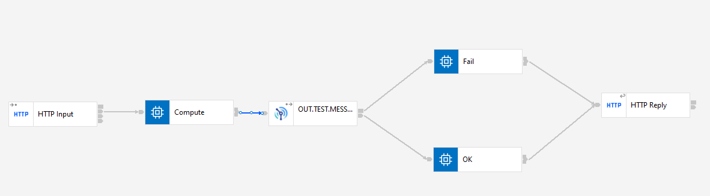
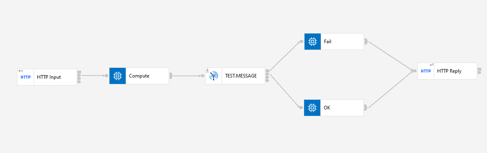

# IBM ACE Utilizando IBM MQ

### Flujo `PutMessage`



### Flujo `ReadMessage`




### Agregar Datos a la MQ

`GET` localhost:7800/ping

```json
{
    Any JSON
}
```

### Leer Datos a la MQ

`GET` localhost:7800/pong