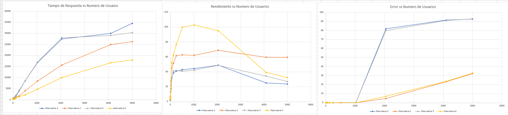

# Jmeter

## Pruebas de Rendimiento

* ### Test de Carga (Load Test)
Prueba de rendimiento utilizada para evaluar cómo actúa el sistema con una carga variable de usuarios pero dentro de los niveles esperados de la aplicación.  Esta prueba da una idea al propietario de la aplicación como actuara su sistema bajo una carga “normal” cuando este esté en producción. [Ref: Tester Moderno](https://www.testermoderno.com/prueba-de-carga-vs-prueba-de-estres-load-test-vs-stress-test/)

* ### Test de Estres (Stress Testing)

Una prueba de estrés evalúa el sistema sometiéndolo a una carga creciente hasta que el sistema colapsa. Esta prueba permitirá identificar cuellos de botella “bottleneck” y conocer que carga es la máxima admitida por la aplicación. [Ref: Tester Moderno](https://www.testermoderno.com/prueba-de-carga-vs-prueba-de-estres-load-test-vs-stress-test/)

### Criterios de Medición

| N° Muestras | N° Usuarios (Hilos) | Periodo de Despliegue (seg) | Tiempo de Respuesta Promedio (ms) | Rendimiendo (peticiones/seg) | Tiempo de Respuesta Minimo (ms) | Tiempo de Respuesta Maximo (ms) | Latencia (ms) | Datos Enviados (Kb/seg) | Datos Recibidos (Kb/seg) | Error (%) |
|-------------|---------------------|-----------------------------|-----------------------------------|------------------------------|---------------------------------|---------------------------------|---------------|-------------------------|--------------------------|-----------|
| 100         | 1                   | 1                           |                                   |                              |                                 |                                 |               |                         |                          |           |
| 100         | 2                   | 1                           |                                   |                              |                                 |                                 |               |                         |                          |           |
| 100         | 4                   | 1                           |                                   |                              |                                 |                                 |               |                         |                          |           |
| 100         | 8                   | 1                           |                                   |                              |                                 |                                 |               |                         |                          |           |
| 100         | 16                  | 1                           |                                   |                              |                                 |                                 |               |                         |                          |           |
| 100         | 32                  | 1                           |                                   |                              |                                 |                                 |               |                         |                          |           |
| 100         | 64                  | 1                           |                                   |                              |                                 |                                 |               |                         |                          |           |
| 100         | 128                 | 1                           |                                   |                              |                                 |                                 |               |                         |                          |           |

[Tabla Generada con `tableconvert`](https://tableconvert.com)

### Medición de Uso de Memoria y de Milicores

| Numero de Usuarios     | Memoria (MiB)      |  CPU (Millicores)   |
|:------:|:-------:|:-----:|
| 1    | 315.5 | 30  |
| 2    | 315.5 | 30  |
| 4    | 315.6 | 30  |
| 8    | 315.7 | 31  |
| ...  | ...   | ..  |
| 4096 | 452   | 271 |
| 5000 | 463.8 | 314 |

### Ejemplo de Graficas

